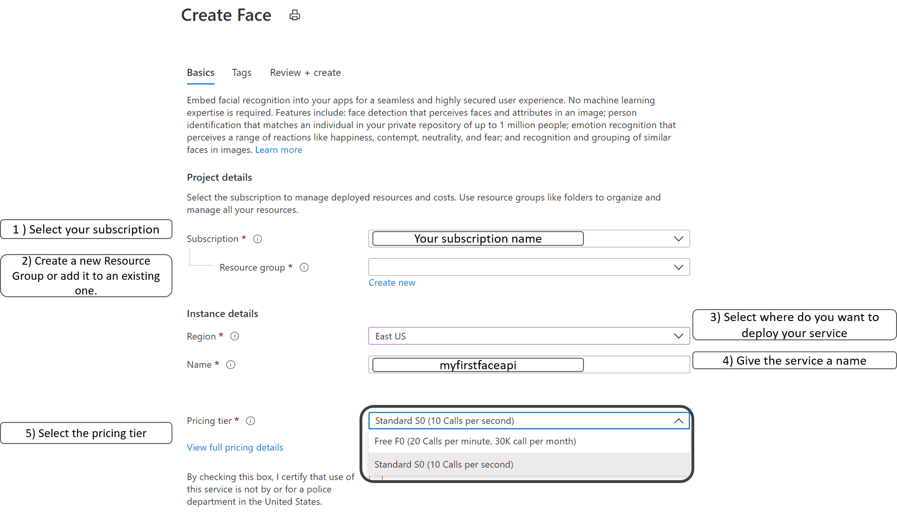
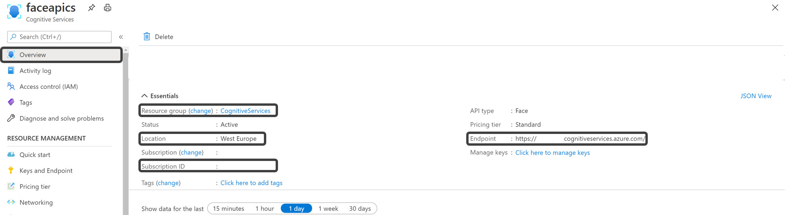
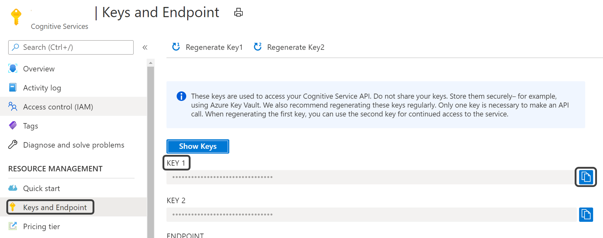

# FaceBlur
Detects faces into pictures using the Azure Cognitive Services Face API and blurs them to anonymize the information.

**Original Picture**             |  **Final Result**
:-------------------------:|:-------------------------:
  |  

The [sample_images](./sample_images/) folder contains some images downloaded from [unsplash](https://unsplash.com/) that can be use to quickly run the notebook. 

## Step 1: Create the Azure Cognitive Service API
Navigate to the [Azure Portal](portal.azure.com) and login in to your subscription. If you don't have one, you can create your **Azure free account** [here](https://azure.microsoft.com/en-us/free/). 

Once you have your Azure subscription, create a [**Face API resource**](https://portal.azure.com/#create/Microsoft.CognitiveServicesFace) in the Azure portal to get a **key** and **endpoint**. 

Toggle the checkbox and click on **Review and Create** to proceed to the last step: click the **Create** button. When the resource has been deployed, click on **Go to resource** or navigate to the Resource Group where you deployed it. 

## Step 2: Gather information on the service and fill up config file
To make the notebook work correctly, you'll need to put some information into the [**config.json**](https://github.com/guendas/FaceBlur/blob/master/notebook/config.json) file. Open the file.

On your resource on Azure left menu, navigate to the *Overview* tab. Copy-paste the values listed below as values in the config file:

* Subscription id --> *subscription_id*
* Resource group name --> *resource_group_name* ;
* Face API Endpoint --> *face_api_endpoint*;
* Location --> *face_api_location*.

On the left side menu, navigate to *Keys and Endpoints* and click on the button on the right of the **Key 1** to copy and paste the key into your config.json as *face_api_key* value.

## Step 3: Run your notebook
You can simply start the notebook locally or on **Azure Machine Learning Service**.

**Few recommendations**:
* You might need to download the packages imported in the first cell
* You need to insert the *image url*. There are test images available [here](./sample_images/)

## TODOs:
* Finish implementation of the notebook so that it takes and sends to the API a local image;
* Implement a complete Azure architecture using Azure Python Functions and Azure Storage account.

## Resources
* [**Face API**](https://azure.microsoft.com/en-us/services/cognitive-services/face/#get-started)
* [**What is the Azure Face Service**](https://docs.microsoft.com/en-us/azure/cognitive-services/face/overview)
* [**Detect faces in an image using Python**](https://docs.microsoft.com/en-us/azure/cognitive-services/face/quickstarts/python)