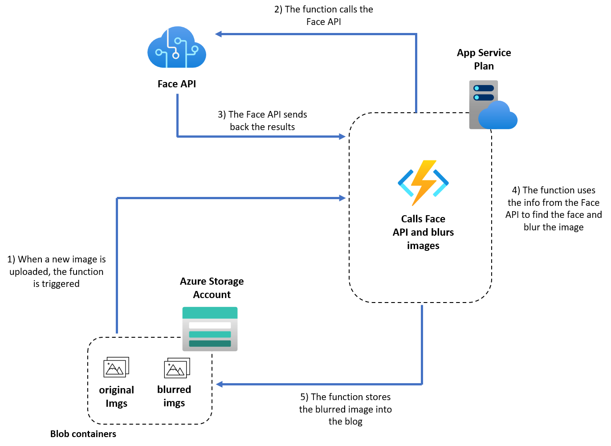

# FaceBlur
## Scenario
Detects faces into pictures using the Azure Cognitive Services Face API and blurs them to anonymize the information.

**Original Picture**             |  **Final Result**
:-------------------------:|:-------------------------:
  |  

## What's in this repo

In this repository you'll find different ways and languages to deploy and solve the problem! 

First of all, if you need some test images you can find them [here](./sample_images/). These images have been downloaded from [unsplash](https://unsplash.com/). 

You can **deploy the solution** in two different ways:
* Using a **Jupyter Notebook** and **Azure Machine Learning Service** (how-to [here](https://github.com/guendas/FaceBlur/blob/master/notebook/README.md))
* Using **Azure Functions** (how-to [here](https://github.com/guendas/FaceBlur#functions)). In the [**functions**](https://github.com/guendas/FaceBlur/tree/master/functions) folder you can find the deployment both in *python* and *C#*, so choose the language you prefer!

## Before you start
You can run the solution locally, using *Visual Studio Code* and few extensions, *Visual Studio* or you can run it on *Azure*. Depending on which option you'll choose you need to set up the environment. 

### Visual Studio Code
Download **Visual Studio Code** from free [here](https://code.visualstudio.com/download) and install it on your device. 
Once you have installed it, go to **Extensions** (*Ctrl+shift+X* if you want to use shortcuts) and install the following extensions:
* [Azure Account](https://marketplace.visualstudio.com/items?itemName=ms-vscode.azure-account) 
* [Azure Functions](https://marketplace.visualstudio.com/items?itemName=ms-azuretools.vscode-azurefunctions)
* [Python](https://marketplace.visualstudio.com/items?itemName=ms-python.python)
* [Jupyter](https://marketplace.visualstudio.com/items?itemName=ms-toolsai.jupyter)
* [C#](https://marketplace.visualstudio.com/items?itemName=ms-dotnettools.csharp)
### Visual Studio
*todo*
### Azure subscription
Navigate to the [Azure Portal](portal.azure.com) and login in to your subscription. If you don't have one, you can create your **Azure free account** [here](https://azure.microsoft.com/en-us/free/). 

## Let's try it!
### Notebook
To deploy and run the notebook follow the instruction you find [here](https://github.com/guendas/FaceBlur/blob/master/notebook/README.md)
### Functions
#### Architecture

 

#### Functions languages 
You can deploy and run the function both in *C#* and *python*. Choose the language you prefer and follow the instruction:
* [C# function](https://github.com/guendas/FaceBlur/blob/master/functions/C%23/FaceBlurAPI/README.md)
* [python function](https://github.com/guendas/FaceBlur/blob/master/functions/python/azure-functions/BlobTrigger/readme.md)

## Resources
* [**Face API**](https://azure.microsoft.com/en-us/services/cognitive-services/face/#get-started)
* [**What is the Azure Face Service**](https://docs.microsoft.com/en-us/azure/cognitive-services/face/overview)
* [**Detect faces in an image using Python**](https://docs.microsoft.com/en-us/azure/cognitive-services/face/quickstarts/python)
* [**Azure Functions**](https://azure.microsoft.com/en-us/services/functions/)
* [**Azure Functions docs**](https://docs.microsoft.com/en-us/azure/azure-functions/)
* [**Azure Function with Python**](https://docs.microsoft.com/en-us/azure/azure-functions/functions-reference-python)
* [**Azure Functions - Blob trigger**](https://docs.microsoft.com/en-us/azure/azure-functions/functions-bindings-storage-blob)